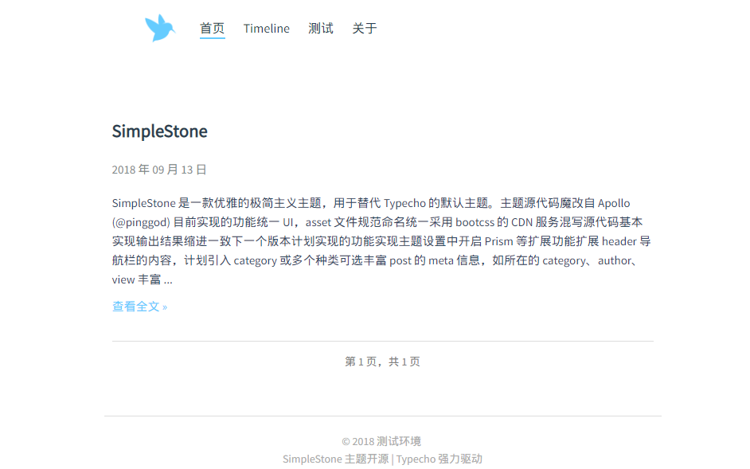

# SimpleStone

SimpleStone 是一款优雅的极简主义主题，用于替代 Typecho 的默认主题。

> 主题源代码魔改自 Apollo

### 目前实现的功能 v0.2.4
 - 丰富 post 和 archive 的 meta 信息（category、author、tag）
 - 分离 meta 代码，代码复用
 - 优化摘要输出，不再采用截取字符长度的形式
 - 优化部分小细节

---

### 目前实现的功能 v0.2.2
- 统一 UI，asset 文件规范命名
- 统一采用 bootcss 的 CDN 服务
